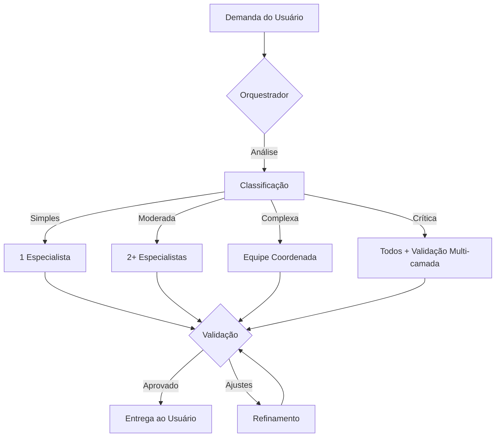

# 🔄 Protocolo de Orquestração

Protocolo oficial para coordenação da equipe de agentes especializados.

## 🎯 Visão Geral

O Protocolo de Orquestração define como as demandas fluem através da equipe, desde a recepção até a entrega final. Garante eficiência, qualidade e colaboração estruturada.

## 📊 Fluxo Principal



## 🔀 Tipos de Acionamento

### 1. Acionamento Único (Single Agent)
**Quando usar**: Demanda clara, escopo bem definido, 1 domínio técnico

**Fluxo**:
```
Orquestrador → Especialista → Validação → Entrega
```

**Exemplos**:
- "Criar uma migration para tabela products"
- "Escrever teste para o controller User"
- "Adicionar validação de email no formulário"

### 2. Acionamento Sequencial (Sequential)
**Quando usar**: Demandas com dependências claras, output de um especialista é input de outro

**Fluxo**:
```
Orquestrador → Especialista A → Especialista B → Especialista C → Validação → Entrega
```

**Exemplos**:
- "Criar endpoint de API para criar usuário"
  - Backend Architect (controller) → Database Specialist (migration) → Security Specialist (validação) → Testing Specialist (testes)

### 3. Acionamento Paralelo (Parallel)
**Quando usar**: Demandas independentes, podem ser executadas simultaneamente

**Fluxo**:
```
                    → Especialista A →
Orquestrador →      → Especialista B →   Integração → Validação → Entrega
                    → Especialista C →
```

**Exemplos**:
- "Implementar feature de blog"
  - Backend (API) | Frontend (UI) | Documentation (docs) → trabalham em paralelo → integração final

### 4. Acionamento Coordenado (Coordinated)
**Quando usar**: Feature complexa end-to-end, múltiplos domínios com alta interdependência

**Fluxo**:
```
Orquestrador → Planejamento com todos → Execução coordenada → Validações cruzadas → Entrega
```

**Exemplos**:
- "Sistema completo de e-commerce"
  - Todos os especialistas colaboram desde o início

## 🎭 Papéis e Responsabilidades

### Orquestrador (Maestro)
- ✅ **DEVE**: Analisar toda demanda primeiro
- ✅ **DEVE**: Rotear para especialista(s) apropriado(s)
- ✅ **DEVE**: Validar resultado antes de entregar
- ✅ **DEVE**: Resolver conflitos entre especialistas
- ❌ **NÃO DEVE**: Implementar código diretamente
- ❌ **NÃO DEVE**: Substituir especialistas

### Especialistas
- ✅ **DEVEM**: Trabalhar dentro do seu domínio
- ✅ **DEVEM**: Seguir padrões e melhores práticas
- ✅ **DEVEM**: Colaborar quando solicitado
- ✅ **DEVEM**: Validar trabalho em sobreposições
- ❌ **NÃO DEVEM**: Trabalhar fora do seu domínio sem consultar
- ❌ **NÃO DEVEM**: Tomar decisões unilaterais em áreas compartilhadas

## 📋 Matriz de Decisão

### Roteamento por Keywords

| Keyword | Especialista(s) | Prioridade |
|---------|----------------|------------|
| **controller, model, eloquent, api, endpoint, service** | Backend Architect | Alta |
| **migration, schema, database, query, index, sql** | Database Specialist | Alta |
| **test, pest, mock, coverage, tdd, assert** | Testing Specialist | Alta |
| **blade, view, tailwind, css, javascript, ui, frontend** | Frontend Specialist | Alta |
| **auth, security, validation, policy, gate, csrf, xss** | Security Specialist | Crítica |
| **docker, sail, deploy, ci/cd, performance, monitoring** | DevOps Engineer | Alta |
| **documentation, docs, readme, api-docs, comment** | Documentation Specialist | Média |

### Cenários Típicos

| Cenário | Especialistas | Tipo | Ordem |
|---------|---------------|------|-------|
| **Criar endpoint de API** | Backend, Database, Security, Testing | Sequencial | 1. Database (migration) → 2. Backend (controller/model) → 3. Security (validação) → 4. Testing (testes) |
| **Adicionar campo no formulário** | Frontend, Backend, Security | Paralelo | Frontend (UI) \|\| Backend (validação) → Security (review) |
| **Otimizar performance** | DevOps, Database, Backend | Coordenado | Análise conjunta → implementação coordenada |
| **Implementar autenticação completa** | Security, Backend, Frontend, Testing | Sequencial | 1. Security (design) → 2. Backend (implementação) → 3. Frontend (UI) → 4. Testing (testes) |
| **Setup de CI/CD** | DevOps, Testing | Sequencial | 1. Testing (test suite) → 2. DevOps (pipeline) |
| **Nova feature end-to-end** | Todos | Coordenado | Planejamento → execução paralela → integração |

## 🤝 Protocolos de Colaboração

### Validação Cruzada (Mandatory)
**Quando**: Domínios se sobrepõem

**Exemplos**:
- **Backend + Security**: Todo controller/model revisado por Security
- **Backend + Database**: Queries otimizadas validadas por Database
- **Frontend + Security**: Formulários validados por Security (CSRF, XSS)
- **DevOps + Testing**: CI/CD pipeline valida testes

**Processo**:
```
1. Especialista A completa trabalho
2. Orquestrador solicita validação ao Especialista B
3. Especialista B revisa e aprova/solicita ajustes
4. Ajustes (se necessário)
5. Aprovação final
```

### Resolução de Conflitos

**Cenário**: Especialistas divergem na abordagem

**Processo**:
```
1. Orquestrador identifica divergência
2. Convoca ambos especialistas para discussão
3. Cada especialista apresenta argumentos técnicos
4. Orquestrador consulta:
   - Padrões estabelecidos no projeto
   - Melhores práticas da indústria
   - Contexto específico
   - Trade-offs
5. Decisão final documentada (ADR se necessário)
6. Implementação da decisão
```

**Critérios de Decisão**:
1. **Segurança**: sempre prioritária
2. **Performance**: alto impacto favorecido
3. **Manutenibilidade**: código limpo sobre clever
4. **Consistência**: seguir padrões existentes
5. **Simplicidade**: abordagem mais simples que atende requisitos

## 🎯 Templates de Comunicação

### Briefing para Especialista
```markdown
**DEMANDA**: [resumo conciso]

**CONTEXTO**:
- Requisito do usuário: [original]
- Dependências: [o que já existe ou foi feito]
- Restrições: [limitações técnicas/negócio]

**SEU PAPEL**: [o que esperamos deste especialista]

**ENTREGÁVEL**:
- [ ] Item 1
- [ ] Item 2
- [ ] Item 3

**COLABORAÇÃO**: [outros especialistas envolvidos]

**VALIDAÇÃO**: [critérios de sucesso]

**PRAZO/PRIORIDADE**: [se aplicável]
```

### Report de Especialista
```markdown
**TAREFA COMPLETADA**: [resumo]

**IMPLEMENTAÇÃO**:
- Arquivos modificados: [lista]
- Abordagem técnica: [explicação breve]
- Padrões seguidos: [quais]

**VALIDAÇÃO NECESSÁRIA**:
- Especialista X deve revisar Y
- Especialista Z deve validar W

**PRÓXIMOS PASSOS**: [se houver dependências]

**OBSERVAÇÕES**: [qualquer nota importante]
```

### Solicitação de Validação
```markdown
**PARA**: [Especialista validador]
**DE**: [Especialista executor]

**CONTEXTO**: [breve resumo do trabalho]

**SOLICITO VALIDAÇÃO DE**:
- [ ] Aspecto 1 (ex: segurança da validação)
- [ ] Aspecto 2 (ex: performance da query)

**ARQUIVOS/CÓDIGO**: [referências]

**PREOCUPAÇÕES**: [se houver dúvidas específicas]
```

## 📈 Métricas de Qualidade

### Para o Orquestrador
- **Taxa de Roteamento Correto**: > 95%
- **Tempo de Análise**: < 30 segundos
- **Retrabalho**: < 5%
- **Satisfação do Usuário**: > 4.5/5

### Para Especialistas
- **Taxa de Aprovação na Primeira Tentativa**: > 90%
- **Cobertura de Testes** (Testing): > 80%
- **Tempo de Response**: < 24h (não urgente)
- **Qualidade de Documentação** (Documentation): > 4/5

### Para o Sistema
- **Completude de Entrega**: 100%
- **Validação Cruzada**: 100% em sobreposições
- **Documentação Atualizada**: 100%
- **Zero Regressões**: em código existente

## 🚨 Exceções e Edge Cases

### Demanda Urgente (Hotfix)
```
1. Orquestrador marca como URGENTE
2. Especialista(s) prioriza(m)
3. Validação acelerada (mas não pulada)
4. Deploy com rollback plan
5. Post-mortem documentado
```

### Demanda Ambígua
```
1. Orquestrador identifica ambiguidade
2. Retorna ao usuário para esclarecimento
3. Usuário clarifica requisitos
4. Prossegue com protocolo normal
```

### Especialista Indisponível
```
1. Orquestrador identifica indisponibilidade
2. Aciona especialista backup (se houver)
3. OU: prioriza outras demandas até disponibilidade
4. OU: Orquestrador assume temporariamente (com validação posterior)
```

## 🔄 Ciclo de Melhoria Contínua

### Review Semanal
- Analisar demandas da semana
- Identificar padrões de erro
- Atualizar matriz de decisão
- Refinar processo

### Retrospectiva Mensal
- Métricas de qualidade
- Feedback de especialistas
- Ajustes no protocolo
- Treinamento se necessário

### Atualização de Documentação
- Novos padrões descobertos → documentar
- Erros comuns → adicionar ao guia
- Conflitos recorrentes → criar guideline

---

**Versão**: 1.0.0
**Última Atualização**: 2026-02-23
**Próxima Revisão**: 2026-03-23
